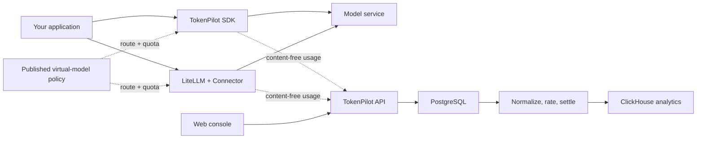

# TokenPilot

**A self-hosted tool for Token analytics, model routing, and AI Unit rules.**

[简体中文](README.zh-CN.md) · [Documentation](docs/README.md) · [Contributing](CONTRIBUTING.md) · [Apache-2.0](LICENSE)

> [!WARNING]
> **TokenPilot is under active development.** APIs, database schemas, deployment settings, and SDK
> contracts may change without backward compatibility. Use it for evaluation and controlled
> environments. Do not use it as the only record for production billing yet.

## What TokenPilot does

TokenPilot keeps model usage, routing, and AI Unit rules in one self-hosted control plane. It can:

- report Token usage, latency, errors, provider cost, and AI Unit by application, user, model,
  feature, or custom field;
- register LiteLLM, OpenAI-compatible, and Anthropic connections without storing provider keys;
- route a stable virtual model name to real models by order, weight, time, user condition, or
  temporary override;
- record an amount reported by the caller, or calculate a fallback amount from ordered rules;
- calculate AI Unit separately from cost and enforce a per-user allowance;
- save filters and reports to each application's dashboard.

Applications connect through the Node SDK, Python SDK, or LiteLLM Connector. Each client keeps a
local SQLite queue so temporary control-plane outages do not lose usage events. Published routing
is cached locally and can continue using its last valid version during a short outage.

TokenPilot does not proxy model traffic. Prompts, responses, tool arguments, and provider keys stay
in the application or LiteLLM process.

## How it works



Before a call, the SDK or Connector resolves the virtual model to a real model and connection, then
checks the user's allowance. A published policy can switch between registered LiteLLM and direct
connections without changing application code. After each attempt, the client keeps only allowed
usage fields, writes the event to its local SQLite queue, and uploads it. The Worker calculates cost
and AI Unit outside the model response path.

PostgreSQL owns configuration, users, quotas, and rating decisions. Redis coordinates jobs and
short-lived runtime state. ClickHouse serves analytics and reports. All three are required by the
current deployment.

## Project status

The current `0.x` series is a development release. Automated contract, integration, and acceptance
tests cover the main workflow, but the API and database schema are not stable yet.

Before production use, test failure handling, retention, rates, backups, and access controls in your
own environment. Keep the provider's own usage or cost record for reconciliation. See the
[changelog](CHANGELOG.md) for changes.

## Quick start

Requirements:

- A Linux host
- Docker Engine with the current Docker Compose plugin
- OpenSSL

```bash
git clone https://github.com/leconio/TokenPilot.git
cd tokenpilot

./scripts/init-env.sh
# Review the generated .env before starting the stack.

docker compose up -d --build --wait
```

Open [http://127.0.0.1:8080](http://127.0.0.1:8080). The first-run flow creates the administrator and
first application, then displays the initial application keys once.

Next:

1. Add a call connection. Choose LiteLLM, an OpenAI-compatible service, or Anthropic.
2. Add real models, configure cost fallbacks when callers cannot report cost, and define AI Unit rates.
3. Create a virtual model such as `customer-support`, arrange its preferred and fallback models,
   and publish it.
4. Copy the Node, Python, or LiteLLM example shown by Setup and configure referenced credentials in
   the application environment.
5. Call the virtual model and confirm that usage, AI Cost, AIU, and the application user appear.

The default ingress binds only to loopback. Do not expose it publicly before configuring TLS,
firewall rules, trusted proxy handling, secure cookies, and access controls. PostgreSQL, Redis, and
ClickHouse are not published by the default Compose project. See the
[deployment guide](docs/deployment.md) before operating a shared instance.

## Connect an application

For a new application, use the Node or Python SDK and call `chat` with a virtual model name.
Credentials and existing provider clients stay in the application. A new policy can switch between
registered connections without changing that call. Existing LiteLLM applications can install the
Connector for routing, allowance checks, and usage reporting.

The [integration guide](docs/integration.md) has Node, Python, LiteLLM, and manual-reporting
examples. The included fake provider can test the full path without a real provider key.

## AI Unit

An AI Unit is a product-defined usage unit. It is separate from provider currency. A rate card can
assign different weights to requests, input, cache, reasoning, output, and other supported usage.
Each result keeps the rate-card version used at the time, so later edits do not change history.

AI Unit is a measurement and quota mechanism, not a payment processor or customer invoicing
system. Read [Concepts and calculations](docs/concepts.md) for the data model, calculations, and
storage responsibilities.

## Development

The workspace uses Node.js 24, pnpm 11, Python 3.12, and `uv`.

```bash
corepack enable
pnpm install --frozen-lockfile
uv sync --project connectors/litellm --locked --all-groups
uv sync --project sdks/python --locked --all-groups

pnpm check:structure
pnpm check:contracts
pnpm lint
pnpm typecheck
pnpm test
pnpm build
```

Start with [CONTRIBUTING.md](CONTRIBUTING.md) and the [development guide](docs/development.md).

## Documentation

- [Project guide](docs/guide.md)
- [Concepts and calculations](docs/concepts.md)
- [LiteLLM and SDK integration](docs/integration.md)
- [Step-by-step tutorial](docs/tutorial.md)
- [Deployment](docs/deployment.md)
- [Operations and recovery](docs/operations.md)
- [API reference](docs/api.md)
- [Development and architecture](docs/development.md)

## Security

Report vulnerabilities privately as described in [SECURITY.md](SECURITY.md). Never include API
keys, provider credentials, prompts, responses, or production usage payloads in public issues.

## License

TokenPilot is available under the [Apache License 2.0](LICENSE).
