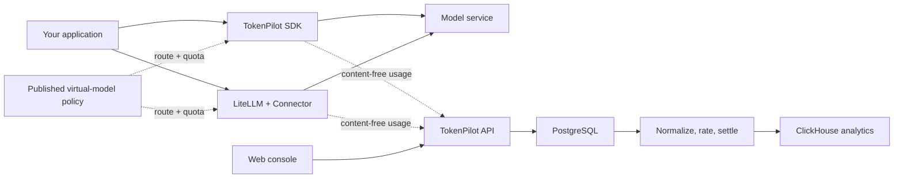

# TokenPilot

**Self-hosted Token analytics, model routing, and AI Unit design for AI applications.**

[简体中文](README.zh-CN.md) · [Documentation](docs/README.md) · [Contributing](CONTRIBUTING.md) · [Apache-2.0](LICENSE)

> [!WARNING]
> **TokenPilot is under active development.** APIs, database schemas, deployment defaults, and SDK
> contracts may change without backward compatibility. It is suitable for evaluation and controlled
> environments, but is not yet recommended as the sole source of truth for production billing.

## Why TokenPilot

Shipping an AI feature is easy; operating it across users, models, providers, and applications is
not. Product teams still need consistent answers to questions such as:

- Which users, features, and models are driving token usage and provider cost?
- How do we express product usage in a stable unit when providers price models differently?
- How do we enforce per-user quotas without putting provider credentials in another service?
- How do we route a stable product-facing model name to real models, schedules, and fallbacks?
- How do we keep usage collection reliable when the control plane is temporarily unavailable?

TokenPilot provides a self-hosted control plane for those concerns. Its Node and Python SDKs, and
its optional LiteLLM Connector, send content-free usage events to the same pipeline. TokenPilot
calculates provider cost and product-defined **AI Units**, maintains user quotas, and publishes
runtime routing policies to applications without changing the virtual model name used in code.

TokenPilot does **not** proxy model traffic or require Provider API keys. Prompts, responses, tool
arguments, and Provider credentials stay in your application or LiteLLM environment.

## What it provides

- Usage analytics by application, user, model, provider, feature, and custom property.
- Token, request, latency, error, provider-cost, and AI Unit dashboards.
- Call connections for LiteLLM, OpenAI-compatible services, and Anthropic, plus a real-model catalog
  with independent provider-cost and AI Unit rates.
- Virtual models with candidate models, fallback order, schedules, conditions, and temporary
  overrides.
- Per-user quotas with reservation, settlement, release, reset, and hard-limit modes.
- Trusted Node and Python execution SDKs, plus an optional LiteLLM callback Connector; every path
  uses a crash-safe local SQLite spool and background retries.
- Runtime policy snapshots with validation, ETag polling, acknowledgements, and last-known-good
  recovery.
- Node and Python SDKs plus a Chinese and English administration console.

## How it works



Before a model call, the SDK or Connector translates a virtual model into a real model and call
connection, then applies quota rules. It can move between registered LiteLLM and direct connections
and use the published fallback sequence without an application redeploy. After every real model
attempt, it allowlists usage fields, commits the event to a local SQLite WAL spool, and uploads it.
Workers rate actual usage, reconcile quota settlement, and deliver analytics outside the model
response path.

PostgreSQL owns configuration, users, quotas, and rating decisions. Redis coordinates jobs and
short-lived runtime state. ClickHouse serves analytics and reports. All three are required by the
current deployment.

## Project status

The current `0.x` series is a development release. The core end-to-end flow is implemented and
covered by automated contract, integration, and acceptance tests, but the project has not declared
a stable API or migration-compatibility policy yet.

Before production use, evaluate the failure modes, retention settings, rate definitions, backup
procedures, and security controls in your own environment. Keep an independent provider usage or
cost record for reconciliation. See the [changelog](CHANGELOG.md) for notable changes.

## Quick start

Requirements:

- A Linux host
- Docker Engine with the current Docker Compose plugin
- OpenSSL

```bash
git clone https://github.com/leconio/TokenPilot.git
cd tokenpilot

./scripts/init-env.sh
# Review the generated .env before starting the stack.

docker compose up -d --build --wait
```

Open [http://127.0.0.1:8080](http://127.0.0.1:8080). The first-run flow creates the administrator and
first application, then displays the initial application keys once.

Next:

1. Add a call connection. Choose LiteLLM, an OpenAI-compatible service, or Anthropic.
2. Add real models and define their provider-cost and AI Unit rates.
3. Create a virtual model such as `customer-support`, arrange its preferred and fallback models,
   and publish it.
4. Copy the Node, Python, or LiteLLM example shown by Setup and configure referenced credentials in
   the application environment.
5. Call the virtual model and confirm that usage, AI Cost, AIU, and the application user appear.

The default ingress binds only to loopback. Do not expose it publicly before configuring TLS,
firewall rules, trusted proxy handling, secure cookies, and access controls. PostgreSQL, Redis, and
ClickHouse are not published by the default Compose project. See the
[deployment guide](docs/deployment.md) before operating a shared instance.

## Connect an application

For a new application, the Node or Python SDK is the shortest path: call `chat` with a virtual model
name and register credentials or an existing Provider client locally. The same code keeps working
when a published policy switches between registered connections. LiteLLM users can instead install
the custom Connector; it participates in pre-call routing and quota decisions and records success
and failure callbacks.

See the [integration guide](docs/integration.md) for Node, Python, LiteLLM, and manual-reporting
examples. The repository includes a fake Provider, so the full path can be evaluated without a real
Provider key.

## AI Unit

An AI Unit is a product-defined usage unit, independent of a provider's currency. A team can assign
different weights to a request, input tokens, cached tokens, reasoning tokens, output tokens, and
other supported metrics. TokenPilot records the rate snapshot used by each decision so later rate
changes do not rewrite historical usage.

AI Unit is a measurement and quota mechanism, not a payment processor or customer invoicing
system. Read [Concepts and calculations](docs/concepts.md) for the data model and authority rules.

## Development

The workspace uses Node.js 24, pnpm 11, Python 3.12, and `uv`.

```bash
corepack enable
pnpm install --frozen-lockfile
uv sync --project connectors/litellm --locked --all-groups
uv sync --project sdks/python --locked --all-groups

pnpm check:structure
pnpm check:contracts
pnpm lint
pnpm typecheck
pnpm test
pnpm build
```

Start with [CONTRIBUTING.md](CONTRIBUTING.md) and the [development guide](docs/development.md).

## Documentation

- [Project guide](docs/guide.md)
- [Concepts and calculations](docs/concepts.md)
- [LiteLLM and SDK integration](docs/integration.md)
- [Step-by-step tutorial](docs/tutorial.md)
- [Deployment](docs/deployment.md)
- [Operations and recovery](docs/operations.md)
- [API reference](docs/api.md)
- [Development and architecture](docs/development.md)

## Security

Report vulnerabilities privately as described in [SECURITY.md](SECURITY.md). Never include API
keys, Provider credentials, prompts, responses, or production usage payloads in public issues.

## License

TokenPilot is available under the [Apache License 2.0](LICENSE).
