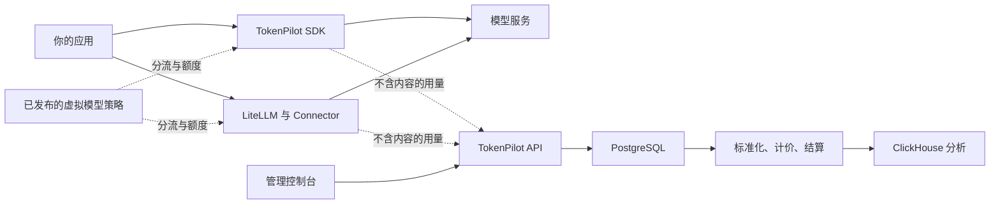

# TokenPilot

**用于统计 Token、控制模型分流和设计 AI Unit 计量规则的自托管工具。**

[English](README.md) · [中文文档](docs/README.zh-CN.md) · [参与贡献](CONTRIBUTING.md) · [Apache-2.0](LICENSE)

> [!WARNING]
> **TokenPilot 仍在开发中。** API、数据库结构、部署设置和 SDK 契约可能发生不兼容变化。目前适合评估和受控环境试用，暂时不要把它作为生产计费的唯一依据。

## TokenPilot 能做什么

TokenPilot 把模型用量、分流和 AI Unit 规则放在一套自托管控制面中。它可以：

- 按应用、用户、模型、功能和自定义字段统计 Token、延迟、错误、模型花费与 AI Unit；
- 注册 LiteLLM、OpenAI 兼容服务和 Anthropic 连接，但不保存服务商密钥；
- 根据顺序、权重、时间、用户条件或临时规则，把一个稳定的虚拟模型名分流到真实模型；
- 优先记录调用端上报的实际金额，缺失时按有顺序的条件规则计算；
- 独立计算 AI Unit，并限制每个用户可用的 AI Unit 额度；
- 保存筛选条件和报表，并放到当前应用首页。

应用可以接入 Node SDK、Python SDK 或 LiteLLM Connector。每种接入都会在本地使用 SQLite 队列，控制服务短暂不可用时不会丢失用量事件。已发布的分流策略也会缓存到调用端，短暂故障时继续使用最后一份有效配置。

TokenPilot 不代理模型流量。提示词、模型回复、工具参数和服务商密钥仍留在应用或 LiteLLM 进程中。

## 工作方式



调用前，SDK 或 Connector 会把虚拟模型解析为真实模型和调用连接，并检查用户额度。只要连接已经注册，发布新策略就能在 LiteLLM 与直连连接之间切换，不用修改业务代码。每次尝试结束后，调用端只保留允许上报的用量字段，先写入本地 SQLite 队列，再上传给 API。Worker 在模型响应链路之外计算成本和 AI Unit。

PostgreSQL 保存配置、用户、额度和计价决策；Redis 协调任务与短期运行状态；ClickHouse 提供统计与报表查询。当前部署需要同时运行这三个数据组件。

## 项目状态

当前 `0.x` 版本仍是开发版本。契约、集成和验收测试覆盖了主要流程，但 API 与数据库结构尚未稳定。

用于生产环境前，请在自己的基础设施中测试故障处理、数据保留、费率、备份恢复和访问控制，并保留服务商自己的账单或用量记录用于对账。重要变化见 [CHANGELOG](CHANGELOG.md)。

## 快速开始

需要准备：

- Linux 主机
- Docker Engine 与当前版本的 Docker Compose 插件
- OpenSSL

```bash
git clone https://github.com/leconio/TokenPilot.git
cd tokenpilot

./scripts/init-env.sh
# 启动前检查生成的 .env。

docker compose up -d --build --wait
```

打开 [http://127.0.0.1:8080](http://127.0.0.1:8080)。首次配置会创建管理员和第一个应用，并且只显示一次初始应用密钥。

接下来：

1. 新增调用连接，可选择 LiteLLM、OpenAI 兼容服务或 Anthropic。
2. 新增真实模型；调用端不能上报成本时配置备用规则，并设置 AI Unit 换算率。
3. 创建 `customer-support` 这样的虚拟模型，排列首选与备用模型并发布。
4. 复制首次配置页提供的 Node、Python 或 LiteLLM 示例，在应用环境中配置所引用的凭据。
5. 调用虚拟模型，确认用量、AI Cost、AIU 和应用用户都已出现。

默认入口只监听回环地址。配置 TLS、防火墙、可信代理、安全 Cookie 和访问控制前，不要把它直接暴露到公网。默认 Compose 项目不会开放 PostgreSQL、Redis 或 ClickHouse。共享环境部署前请阅读[部署指南](docs/deployment.zh-CN.md)。

## 接入应用

新应用可以直接使用 Node 或 Python SDK，并用虚拟模型名调用 `chat`。凭据和已有服务商 Client 留在应用中。新策略可以在已注册连接之间切换，不需要修改这段调用代码。已有 LiteLLM 应用可以安装 Connector，用它执行分流、额度检查和用量上报。

Node、Python、LiteLLM 和手动上报示例见[接入指南](docs/integration.zh-CN.md)。仓库中的假服务可以在没有真实服务商密钥时测试完整链路。

## AI Unit

AI Unit 是产品自定义的用量单位，与服务商币种无关。单价表可以分别设置请求、输入、缓存、推理、输出和其他用量的权重。每次结果都会保存当时使用的单价版本，后续修改不会改写历史。

AI Unit 是统计和额度机制，不是支付处理或客户开票系统。数据结构、计算方式和保存位置见[概念与计算原理](docs/concepts.zh-CN.md)。

## 开发

工作区使用 Node.js 24、pnpm 11、Python 3.12 和 `uv`。

```bash
corepack enable
pnpm install --frozen-lockfile
uv sync --project connectors/litellm --locked --all-groups
uv sync --project sdks/python --locked --all-groups

pnpm check:structure
pnpm check:contracts
pnpm lint
pnpm typecheck
pnpm test
pnpm build
```

请从 [CONTRIBUTING.md](CONTRIBUTING.md) 和[开发指南](docs/development.zh-CN.md)开始。

## 文档

- [项目指南](docs/guide.zh-CN.md)
- [概念与计算原理](docs/concepts.zh-CN.md)
- [LiteLLM 与 SDK 接入](docs/integration.zh-CN.md)
- [上手教程](docs/tutorial.zh-CN.md)
- [部署指南](docs/deployment.zh-CN.md)
- [运维与恢复](docs/operations.zh-CN.md)
- [API 说明](docs/api.zh-CN.md)
- [开发与架构](docs/development.zh-CN.md)

## 安全

请按照 [SECURITY.md](SECURITY.md) 私密报告安全问题。不要在公开 Issue 中提交 API 密钥、服务商凭据、提示词、模型回复或生产用量数据。

## 许可证

TokenPilot 使用 [Apache License 2.0](LICENSE)。
