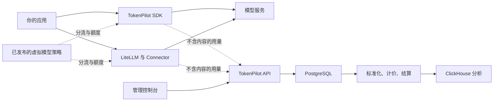

# TokenPilot

**用于统计 Token、控制模型分流并帮助开发者设计 AI Unit 计费的自托管工具。**

[English](README.md) · [中文文档](docs/README.zh-CN.md) · [参与贡献](CONTRIBUTING.md) · [Apache-2.0](LICENSE)

> [!WARNING]
> **TokenPilot 正在积极开发中。** API、数据库结构、部署默认值和 SDK 契约仍可能发生不兼容变化。目前适合评估和受控环境试用，暂不建议把它作为生产计费的唯一数据依据。

## 为什么需要 TokenPilot

接入一个大模型并不难，困难的是长期管理多个用户、模型服务和应用。产品团队仍需要回答：

- 哪些用户、功能和模型消耗了最多 Token 与服务商成本？
- 不同模型定价方式不同，怎样形成稳定、可解释的产品用量单位？
- 怎样执行用户额度，又不把模型服务商密钥交给另一套系统？
- 怎样把产品使用的稳定模型名映射到真实模型、时间策略和 fallback？
- 控制面暂时不可用时，怎样保证用量事件不丢失且不拖慢模型响应？

TokenPilot 为这些问题提供一套自托管控制面。Node、Python SDK 和可选的 LiteLLM Connector 都把不含模型内容的用量事件送入同一条链路。TokenPilot 计算服务商成本与产品自定义的 **AI Unit**、维护用户额度，并把路由策略下发给应用；业务代码使用的虚拟模型名不需要改变。

TokenPilot **不代理**模型流量，也不需要模型服务商 API Key。提示词、模型回复、工具参数和服务商凭据始终留在你的应用或 LiteLLM 环境中。

## 它提供什么

- 按应用、用户、模型、服务商、功能和自定义属性分析用量。
- Token、请求数、延迟、错误、服务商成本和 AI Unit 仪表盘。
- LiteLLM、OpenAI 兼容服务和 Anthropic 调用连接，以及相互独立的真实模型、服务商成本与 AI Unit 换算率。
- 虚拟模型、候选模型、失败顺序、时间条件、匹配规则和临时切换。
- 用户额度，以及预留、结算、释放、重置和严格限制模式。
- Node、Python 可信 SDK 和可选的 LiteLLM Connector；三种路径都使用可靠的本地 SQLite 队列和后台重试。
- 带校验、ETag 轮询、应用确认和最后可用版本恢复的运行时策略。
- Node、Python SDK，以及支持中英文的管理控制台。

## 工作方式



模型调用前，SDK 或 Connector 会把虚拟模型转换为真实模型和调用连接，并执行额度判断。只要连接已经在应用中注册，发布策略后就能在 LiteLLM 与直连模型之间切换或降级，无需重新部署应用。每次真实模型调用后只提取白名单内的用量字段，先写入本地 SQLite WAL 队列，再上传给 API。Worker 在模型响应链路之外按实际用量计价、校准额度并写入统计。

PostgreSQL 保存配置、用户、额度和计价决策；Redis 协调任务与短期运行状态；ClickHouse 提供统计与报表查询。当前部署需要同时运行这三个数据组件。

## 项目状态

当前 `0.x` 版本属于开发版本。核心端到端流程已经实现，并有契约、集成和验收测试覆盖，但项目尚未承诺稳定 API，也没有承诺版本间的数据库迁移兼容性。

用于生产环境前，请在自己的基础设施中评估故障模式、数据保留、费率配置、备份恢复和安全边界，并保留独立的服务商账单或用量记录用于对账。重要变化见 [CHANGELOG](CHANGELOG.md)。

## 快速开始

需要准备：

- Linux 主机
- Docker Engine 与当前版本的 Docker Compose 插件
- OpenSSL

```bash
git clone https://github.com/leconio/TokenPilot.git
cd tokenpilot

./scripts/init-env.sh
# 启动前检查生成的 .env。

docker compose up -d --build --wait
```

打开 [http://127.0.0.1:8080](http://127.0.0.1:8080)。首次配置会创建管理员和第一个应用，并且只显示一次初始应用密钥。

接下来：

1. 新增调用连接，可选择 LiteLLM、OpenAI 兼容服务或 Anthropic。
2. 新增真实模型，并配置服务商成本和 AI Unit 换算率。
3. 创建 `customer-support` 这样的虚拟模型，排列首选与备用模型并发布。
4. 复制首次配置页提供的 Node、Python 或 LiteLLM 示例，在应用环境中配置所引用的凭据。
5. 调用虚拟模型，确认用量、AI Cost、AIU 和应用用户都已出现。

默认入口只监听回环地址。配置 TLS、防火墙、可信代理、安全 Cookie 和访问控制前，不要把它直接暴露到公网。默认 Compose 项目不会开放 PostgreSQL、Redis 或 ClickHouse。共享环境部署前请阅读[部署指南](docs/deployment.zh-CN.md)。

## 接入应用

新应用优先使用 Node 或 Python SDK：业务只调用虚拟模型名，凭据或已有模型 Client 留在应用本地。只要新连接已经注册，之后发布策略即可无感切换模型。LiteLLM 用户也可以安装自定义 Connector，在调用前执行分流与额度判断，并通过成功、失败回调采集每次真实尝试。

Node、Python、LiteLLM 和手动上报示例见[接入指南](docs/integration.zh-CN.md)。仓库附带不需要真实服务商密钥的假服务，可用于验证完整链路。

## AI Unit

AI Unit 是独立于服务商币种、由产品自己定义的用量单位。团队可以为每次请求、输入 Token、缓存 Token、推理 Token、输出 Token 和其他支持的指标设置不同权重。TokenPilot 会记录每次决策使用的费率快照，后续修改费率不会改写历史用量。

AI Unit 是统计和额度机制，不是支付处理或客户开票系统。数据模型和权威规则见[概念与计算原理](docs/concepts.zh-CN.md)。

## 开发

工作区使用 Node.js 24、pnpm 11、Python 3.12 和 `uv`。

```bash
corepack enable
pnpm install --frozen-lockfile
uv sync --project connectors/litellm --locked --all-groups
uv sync --project sdks/python --locked --all-groups

pnpm check:structure
pnpm check:contracts
pnpm lint
pnpm typecheck
pnpm test
pnpm build
```

请从 [CONTRIBUTING.md](CONTRIBUTING.md) 和[开发指南](docs/development.zh-CN.md)开始。

## 文档

- [项目指南](docs/guide.zh-CN.md)
- [概念与计算原理](docs/concepts.zh-CN.md)
- [LiteLLM 与 SDK 接入](docs/integration.zh-CN.md)
- [上手教程](docs/tutorial.zh-CN.md)
- [部署指南](docs/deployment.zh-CN.md)
- [运维与恢复](docs/operations.zh-CN.md)
- [API 说明](docs/api.zh-CN.md)
- [开发与架构](docs/development.zh-CN.md)

## 安全

请按照 [SECURITY.md](SECURITY.md) 私密报告安全问题。不要在公开 Issue 中提交 API 密钥、服务商凭据、提示词、模型回复或生产用量数据。

## 许可证

TokenPilot 使用 [Apache License 2.0](LICENSE)。
